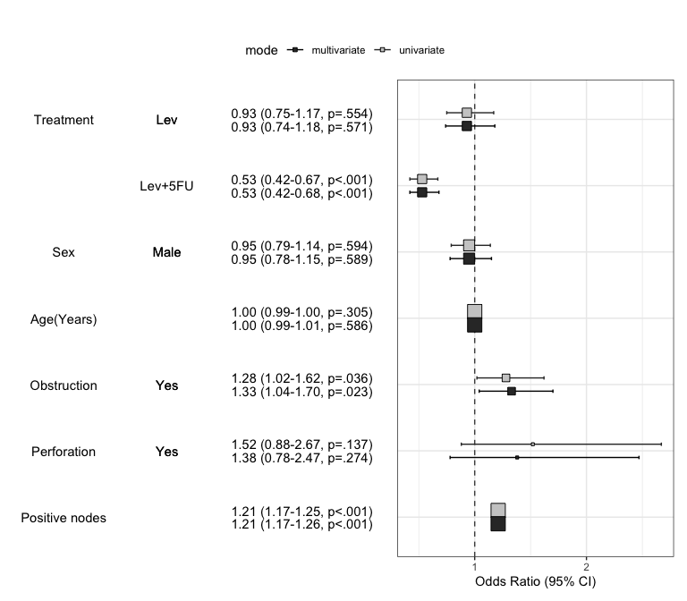

## Installation

You can install autoReg package on github.

``` r
#install.packages("devtools")
devtools::install_github("cardiomoon/autoReg")
```

## Load package

To load the package, use library() function.

``` r
library(autoReg)
```

## Main features

### 1.Summarizing baseline characteristics : gaze()

You can make a table summarizing baseline characteristics easily.

``` r
library(moonBook) # For use of example data acs
gaze(sex~.,data=acs)
————————————————————————————————————————————————————————————————————————
  Dependent:sex        levels           Female          Male        p   
       (N)                             (N=287)        (N=570)           
————————————————————————————————————————————————————————————————————————
age               Mean ± SD             68.7 ± 10.7   60.6 ± 11.2  <.001 
cardiogenicShock  No                    275 (95.8%)     530 (93%)   .136 
                  Yes                     12 (4.2%)       40 (7%)        
entry             Femoral               119 (41.5%)   193 (33.9%)   .035 
                  Radial                168 (58.5%)   377 (66.1%)        
Dx                NSTEMI                 50 (17.4%)   103 (18.1%)   .012 
                  STEMI                  84 (29.3%)   220 (38.6%)        
                  Unstable Angina       153 (53.3%)   247 (43.3%)        
EF                Mean ± SD             56.3 ± 10.1    55.6 ± 9.4   .387 
height            Mean ± SD             153.8 ± 6.2   167.9 ± 6.1  <.001 
weight            Mean ± SD              57.2 ± 9.3   68.7 ± 10.3  <.001 
BMI               Mean ± SD              24.2 ± 3.6    24.3 ± 3.2   .611 
obesity           No                    194 (67.6%)   373 (65.4%)   .580 
                  Yes                    93 (32.4%)   197 (34.6%)        
TC                Mean ± SD            188.9 ± 51.1  183.3 ± 45.9   .124 
LDLC              Mean ± SD            117.8 ± 41.2  116.0 ± 41.1   .561 
HDLC              Mean ± SD             39.0 ± 11.5   37.8 ± 10.9   .145 
TG                Mean ± SD            119.9 ± 76.2  127.9 ± 97.3   .195 
DM                No                    173 (60.3%)   380 (66.7%)   .077 
                  Yes                   114 (39.7%)   190 (33.3%)        
HBP               No                     83 (28.9%)   273 (47.9%)  <.001 
                  Yes                   204 (71.1%)   297 (52.1%)        
smoking           Ex-smoker              49 (17.1%)   155 (27.2%)  <.001 
                  Never                 209 (72.8%)   123 (21.6%)        
                  Smoker                 29 (10.1%)   292 (51.2%)        
————————————————————————————————————————————————————————————————————————
```

### For easy reproducible research : myft()

You can make a publication-ready table easily using myft(). It makes a
flextable object which can use in either HTML and PDF format.

``` r
library(dplyr) # for use of `%>%`

Attaching package: 'dplyr'
The following objects are masked from 'package:stats':

    filter, lag
The following objects are masked from 'package:base':

    intersect, setdiff, setequal, union
ft=gaze(sex~.,data=acs) %>% myft()
ft
```


You can also make a powerpoint file using rrtable::table2pptx()
function.

``` r
library(rrtable)

table2pptx(ft)
```
```
Exported table as Report.pptx
```


You can make a microsoft word file using rrtable::table2docx() function.

``` r
table2docx(ft)
```
```
Exported table as Report.docx
```

### Summarizing baseline characteristics with two or more grouping variables

You can get a table summarizing baseline characteristics with two or
more grouping variables.

``` r
gaze(sex+Dx~.,data=acs) %>% myft()
```


You can also use three or more grouping variables.The resultant table
will be too long to review, but you can try.

``` r
gaze(sex+DM+HBP~age,data=acs) %>% myft()
```


### 2. For automatic selection of explanatory variables : autoReg()

You can make a table summarizing results of regression analysis. For
example, let us perform a logistic regression with the colon cancer
data.

``` r
library(survival)   # For use of data colon
data(cancer)  

fit=glm(status~rx+sex+age+obstruct+perfor+nodes,data=colon,family="binomial")
summary(fit)

Call:
glm(formula = status ~ rx + sex + age + obstruct + perfor + nodes, 
    family = "binomial", data = colon)

Deviance Residuals: 
    Min       1Q   Median       3Q      Max  
-2.4950  -1.0594  -0.7885   1.1619   1.6424  

Coefficients:
             Estimate Std. Error z value Pr(>|z|)    
(Intercept) -0.645417   0.285558  -2.260   0.0238 *  
rxLev       -0.067422   0.118907  -0.567   0.5707    
rxLev+5FU   -0.627480   0.121684  -5.157 2.51e-07 ***
sex         -0.053541   0.098975  -0.541   0.5885    
age          0.002307   0.004234   0.545   0.5859    
obstruct     0.283703   0.125194   2.266   0.0234 *  
perfor       0.319281   0.292034   1.093   0.2743    
nodes        0.190563   0.018255  10.439  < 2e-16 ***
---
Signif. codes:  0 '***' 0.001 '**' 0.01 '*' 0.05 '.' 0.1 ' ' 1

(Dispersion parameter for binomial family taken to be 1)

    Null deviance: 2525.4  on 1821  degrees of freedom
Residual deviance: 2342.4  on 1814  degrees of freedom
  (36 observations deleted due to missingness)
AIC: 2358.4

Number of Fisher Scoring iterations: 4
```

You can make table with above result.

``` r
autoReg(fit)
——————————————————————————————————————————————————————————————————————————————————
 Dependent: status              0 (N=925)    1 (N=897)      OR (multivariable)     
——————————————————————————————————————————————————————————————————————————————————
rx                 Obs          282 (30.5%)  342 (38.1%)                           
                   Lev          285 (30.8%)    323 (36%)  0.93 (0.74-1.18, p=.571) 
                   Lev+5FU      358 (38.7%)  232 (25.9%)  0.53 (0.42-0.68, p<.001) 
sex                Mean ± SD      0.5 ± 0.5    0.5 ± 0.5  0.95 (0.78-1.15, p=.589) 
age                Mean ± SD    60.1 ± 11.5  59.5 ± 12.3  1.00 (0.99-1.01, p=.586) 
obstruct           Mean ± SD      0.2 ± 0.4    0.2 ± 0.4  1.33 (1.04-1.70, p=.023) 
perfor             Mean ± SD      0.0 ± 0.2    0.0 ± 0.2  1.38 (0.78-2.47, p=.274) 
nodes              Mean ± SD      2.7 ± 2.4    4.6 ± 4.2  1.21 (1.17-1.26, p<.001) 
——————————————————————————————————————————————————————————————————————————————————
```

Or you can make a publication-ready table.

``` r
autoReg(fit) %>% myft()
```


If you want make a table with more explanation, you can make categorical
variables with numeric variables. For example, the explanatory variables
obstruct(obstruction of colon by tumor) and perfor(perforation of colon)
is coded as 0 or 1, but it is “No” or “Yes” actually. Also the dependent
variable status is coded as 0 or 1, it is “Alive” or “Died”.

``` r
colon$status.factor=factor(colon$status,labels=c("Alive","Died"))
colon$obstruct.factor=factor(colon$obstruct,labels=c("No","Yes"))
colon$perfor.factor=factor(colon$perfor,labels=c("No","Yes"))
colon$sex.factor=factor(colon$sex,labels=c("Female","Male"))

fit=glm(status.factor~rx+sex.factor+age+obstruct.factor+perfor.factor+nodes,data=colon,family="binomial")
result=autoReg(fit) 
result %>% myft()
```


You can add labels to the names of variables with setLabel() function.

``` r
colon$status.factor=setLabel(colon$status.factor,"Mortality")
colon$rx=setLabel(colon$rx,"Treatment")
colon$age=setLabel(colon$age,"Age(Years)")
colon$sex.factor=setLabel(colon$sex.factor,"Sex")
colon$obstruct.factor=setLabel(colon$obstruct.factor,"Obstruction")
colon$perfor.factor=setLabel(colon$perfor.factor,"Perforation")
colon$nodes=setLabel(colon$nodes,"Positive nodes")

fit=glm(status.factor~rx+sex.factor+age+obstruct.factor+perfor.factor+nodes,data=colon,family="binomial")
result=autoReg(fit) 
result %>% myft()
```


If you do not want to show the reference values in table, you can
shorten the table.

``` r
shorten(result) %>% myft()
```


### Add univariate models to table and automatic selection of explanatory variables

You can add the results of univariate analyses to the table. At this
time, the autoReg() function automatically select explanatory variables
below the threshold(default value 0.2) and perform multivariate
analysis. In this table, the p values of explanatory variables
sex.factor and age is above the default threshold(0.2), they are
excluded in multivariate model.

``` r
autoReg(fit, uni=TRUE) %>% myft()
```


If you want to include all explanatory variables in the multivariate
model, just set the threshold 1.

``` r
autoReg(fit, uni=TRUE,threshold=1) %>% myft()
```


You can perform stepwise backward elimination to select variables and
make a final model. Just set final=TRUE.

``` r
autoReg(fit, uni=TRUE,threshold=1, final=TRUE) %>% myft()
```


#### Multiple imputation with mice()

When the argument imputed=TRUE, autoReg() function make a multiple
imputed model using mice::mice() function. By default, 20 imputations
performed. If you want, you can change the number of imputations with m
argument.

``` r
autoReg(fit, imputed=TRUE) %>% myft()
```


### Summarize regression model results in a plot : modelPlot()

You can draw the plot summarizing the model with modelPlot()

``` r
x=modelPlot(fit)
x
```


You can make powerpoint file with this plot using rrtable::plot2pptx().

``` r
plot2pptx(print(x))
```

```
Exported plot as Report.pptx
```

You can summarize models in a plot. If you want to summarize univariate
and multivariate model in a plot, just set the uni=TRUE and adjust the
threshold. You can decide whether or not show the reference by show.ref
argument.

``` r
modelPlot(fit,uni=TRUE,threshold=1,show.ref=FALSE)
```


