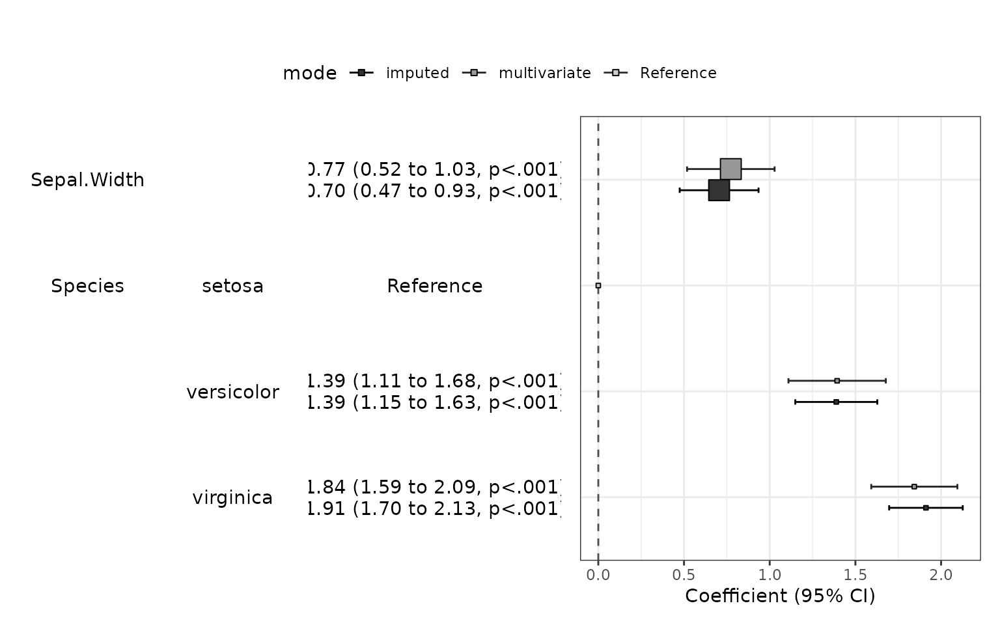

# Automatic Regression Modeling

## Installation

You can install autoReg package on github.

``` r

#install.packages("devtools")
devtools::install_github("cardiomoon/autoReg")
```

## Load package

To load the package, use library() function.

``` r
library(autoReg)
library(dplyr)

Attaching package: 'dplyr'
The following objects are masked from 'package:stats':

    filter, lag
The following objects are masked from 'package:base':

    intersect, setdiff, setequal, union
```

## Linear model with multiple variables

The package `autoReg` aims automatic selection of explanatory variables
of regression models. Let’s begin with famous mtcars data. We select
mpg(miles per gallon) as a dependent variable and select wt(weight),
hp(horse power) and am(transmission, 0=automatic, 1=manual) as
explanatory variables and included all possible interaction. The
autoReg() function make a table summarizing the result of analysis.

``` r
fit=lm(mpg~wt*hp*am,data=mtcars)
autoReg(fit) 
—————————————————————————————————————————————————————————————————————————————————————
Dependent: mpg                    unit         value      Coefficient (multivariable) 
—————————————————————————————————————————————————————————————————————————————————————
wt                [1.5,5.4]  Mean ± SD     3.2 ± 1.0   -4.80 (-13.06 to 3.46, p=.242) 
hp                 [52,335]  Mean ± SD  146.7 ± 68.6    -0.09 (-0.22 to 0.04, p=.183) 
am                    [0,1]  Mean ± SD     0.4 ± 0.5  12.84 (-16.52 to 42.19, p=.376) 
wt:hp                                                    0.01 (-0.03 to 0.05, p=.458) 
wt:am                                                  -5.36 (-14.85 to 4.13, p=.255) 
hp:am                                                   -0.03 (-0.22 to 0.15, p=.717) 
wt:hp:am                  :                              0.02 (-0.04 to 0.07, p=.503) 
—————————————————————————————————————————————————————————————————————————————————————
```

You can make a publication-ready table easily using myft(). It makes a
flextable object which can use in HTML, PDF, microsoft word or
powerpoint file.

``` r

autoReg(fit) %>% myft()
```

| Dependent: mpg |  | unit | value | Coefficient (multivariable) |
|----|----|----|----|----|
| wt | \[1.5,5.4\] | Mean ± SD | 3.2 ± 1.0 | -4.80 (-13.06 to 3.46, p=.242) |
| hp | \[52,335\] | Mean ± SD | 146.7 ± 68.6 | -0.09 (-0.22 to 0.04, p=.183) |
| am | \[0,1\] | Mean ± SD | 0.4 ± 0.5 | 12.84 (-16.52 to 42.19, p=.376) |
| wt:hp |  |  |  | 0.01 (-0.03 to 0.05, p=.458) |
| wt:am |  |  |  | -5.36 (-14.85 to 4.13, p=.255) |
| hp:am |  |  |  | -0.03 (-0.22 to 0.15, p=.717) |
| wt:hp:am | : |  |  | 0.02 (-0.04 to 0.07, p=.503) |
|  |  |  |  |  |

From the result of multivariable analysis, we found no explanatory
variable is significant.

### Selection of explanatory variable from univariable model

You can start with univariable model. With a list of univariable model,
you can select potentially significant explanatory variable(p value
below 0.2 for example). The autoReg() function automatically select from
univariable model with a given p value threshold(default value is 0.2).

``` r

autoReg(fit,uni=TRUE, threshold=0.2) %>% myft()
```

| Dependent: mpg |  | unit | value | Coefficient (univariable) | Coefficient (multivariable) |
|----|----|----|----|----|----|
| wt | \[1.5,5.4\] | Mean ± SD | 3.2 ± 1.0 | -5.34 (-6.49 to -4.20, p\<.001) | -7.50 (-13.21 to -1.80, p=.012) |
| hp | \[52,335\] | Mean ± SD | 146.7 ± 68.6 | -0.07 (-0.09 to -0.05, p\<.001) | -0.11 (-0.20 to -0.02, p=.022) |
| am | \[0,1\] | Mean ± SD | 0.4 ± 0.5 | 7.24 (3.64 to 10.85, p\<.001) | 1.91 (-11.29 to 15.10, p=.769) |
| wt:hp |  |  |  | -0.01 (-0.02 to -0.01, p\<.001) | 0.02 (-0.00 to 0.05, p=.072) |
| wt:am |  |  |  | 1.89 (0.25 to 3.52, p=.025) | -0.60 (-4.92 to 3.73, p=.778) |
| hp:am |  |  |  | 0.01 (-0.02 to 0.04, p=.452) |  |
| wt:hp:am | : |  |  | -0.00 (-0.01 to 0.01, p=.982) |  |
|  |  |  |  |  |  |

As you can see in the above table, the coefficients of hp:am(the
interaction of hp and am) and wt:hp:am (interaction of wt and hp and am)
have p-values above 0.2. So these variables are excluded and the
remaining variables are used in multivariable model. If you want to use
all the explanatory variables in the multivariable model, set the
threshold 1.

### Stepwise backward elimination

From the multivariable model, you can perform stepwise backward
elimination with step() function.

``` r
fit=lm(mpg~hp+wt+am+wt:hp+wt:am,data=mtcars)
final=step(fit,trace=0)
summary(final)

Call:
lm(formula = mpg ~ hp + wt + hp:wt, data = mtcars)

Residuals:
    Min      1Q  Median      3Q     Max 
-3.0632 -1.6491 -0.7362  1.4211  4.5513 

Coefficients:
            Estimate Std. Error t value Pr(>|t|)    
(Intercept) 49.80842    3.60516  13.816 5.01e-14 ***
hp          -0.12010    0.02470  -4.863 4.04e-05 ***
wt          -8.21662    1.26971  -6.471 5.20e-07 ***
hp:wt        0.02785    0.00742   3.753 0.000811 ***
---
Signif. codes:  0 '***' 0.001 '**' 0.01 '*' 0.05 '.' 0.1 ' ' 1

Residual standard error: 2.153 on 28 degrees of freedom
Multiple R-squared:  0.8848,    Adjusted R-squared:  0.8724 
F-statistic: 71.66 on 3 and 28 DF,  p-value: 2.981e-13
```

You can perform univariable analysis for variable selection,
multivariable analysis and stepwise backward elimination in one step.

``` r

fit=lm(mpg~hp*wt*am,data=mtcars)
autoReg(fit,uni=TRUE,final=TRUE) %>% myft()
```

| Dependent: mpg |  | unit | value | Coefficient (univariable) | Coefficient (multivariable) | Coefficient (final) |
|----|----|----|----|----|----|----|
| hp | \[52,335\] | Mean ± SD | 146.7 ± 68.6 | -0.07 (-0.09 to -0.05, p\<.001) | -0.11 (-0.20 to -0.02, p=.022) | -0.12 (-0.17 to -0.07, p\<.001) |
| wt | \[1.5,5.4\] | Mean ± SD | 3.2 ± 1.0 | -5.34 (-6.49 to -4.20, p\<.001) | -7.50 (-13.21 to -1.80, p=.012) | -8.22 (-10.82 to -5.62, p\<.001) |
| am | \[0,1\] | Mean ± SD | 0.4 ± 0.5 | 7.24 (3.64 to 10.85, p\<.001) | 1.91 (-11.29 to 15.10, p=.769) |  |
| hp:wt |  |  |  | -0.01 (-0.02 to -0.01, p\<.001) | 0.02 (-0.00 to 0.05, p=.072) | 0.03 (0.01 to 0.04, p\<.001) |
| hp:am |  |  |  | 0.01 (-0.02 to 0.04, p=.452) |  |  |
| wt:am |  |  |  | 1.89 (0.25 to 3.52, p=.025) | -0.60 (-4.92 to 3.73, p=.778) |  |
| hp:wt:am | : |  |  | -0.00 (-0.01 to 0.01, p=.982) |  |  |
|  |  |  |  |  |  |  |

## Linear model with interaction between categorical variable

You can use autoReg() function for models with interaction with
categorical variable(s).

``` r

fit=lm(Sepal.Length~Sepal.Width*Species,data=iris)
autoReg(fit,uni=TRUE, final=TRUE) %>% myft()
```

| Dependent: Sepal.Length |  | unit | value | Coefficient (univariable) | Coefficient (multivariable) | Coefficient (final) |
|----|----|----|----|----|----|----|
| Sepal.Width | \[2,4.4\] | Mean ± SD | 3.1 ± 0.4 | -0.22 (-0.53 to 0.08, p=.152) | 0.69 (0.36 to 1.02, p\<.001) | 0.80 (0.59 to 1.01, p\<.001) |
| Species | setosa (N=50) | Mean ± SD | 5.0 ± 0.4 |  |  |  |
|  | versicolor (N=50) | Mean ± SD | 5.9 ± 0.5 | 0.93 (0.73 to 1.13, p\<.001) | 0.90 (-0.68 to 2.48, p=.261) | 1.46 (1.24 to 1.68, p\<.001) |
|  | virginica (N=50) | Mean ± SD | 6.6 ± 0.6 | 1.58 (1.38 to 1.79, p\<.001) | 1.27 (-0.35 to 2.88, p=.123) | 1.95 (1.75 to 2.14, p\<.001) |
| Sepal.Width:Species | setosa |  |  | 0.48 (0.29 to 0.67, p\<.001) |  |  |
| Sepal.Width:Species | versicolor |  |  | 0.93 (0.69 to 1.17, p\<.001) | 0.17 (-0.34 to 0.69, p=.503) |  |
| Sepal.Width:Species | virginica |  |  | 1.08 (0.86 to 1.30, p\<.001) | 0.21 (-0.29 to 0.72, p=.411) |  |
|  |  |  |  |  |  |  |

## Missing data - automatic multiple imputation

### Original data

Let us think about linear regression model with iris data. In this
model, Sepal.Length is the dependent variable and Sepal.Width and
Species are explanatory variables. You can make a table summarizing the
result as follows.

``` r

df=gaze(Sepal.Length~Sepal.Width+Species,data=iris)
df %>% myft()
```

| name        | levels            | unit      | value     |
|-------------|-------------------|-----------|-----------|
| Sepal.Width | \[2,4.4\]         | Mean ± SD | 3.1 ± 0.4 |
| Species     | setosa (N=50)     | Mean ± SD | 5.0 ± 0.4 |
|             | versicolor (N=50) | Mean ± SD | 5.9 ± 0.5 |
|             | virginica (N=50)  | Mean ± SD | 6.6 ± 0.6 |

``` r

fit=lm(Sepal.Length~Sepal.Width+Species,data=iris)
df=addFitSummary(df,fit,"Coefficient (original data)")
df %>% myft()
```

| name | levels | unit | value | Coefficient (original data) |
|----|----|----|----|----|
| Sepal.Width | \[2,4.4\] | Mean ± SD | 3.1 ± 0.4 | 0.80 (0.59 to 1.01, p\<.001) |
| Species | setosa (N=50) | Mean ± SD | 5.0 ± 0.4 |  |
|  | versicolor (N=50) | Mean ± SD | 5.9 ± 0.5 | 1.46 (1.24 to 1.68, p\<.001) |
|  | virginica (N=50) | Mean ± SD | 6.6 ± 0.6 | 1.95 (1.75 to 2.14, p\<.001) |

### Missed data

For simulation of the MCAR(missing at completely random) data, one third
of the Sepal.Width records are replace with NA(missing). If you want to
perform missing data analysis, use gaze() function with missing=TRUE.

``` r

iris1=iris
set.seed=123
no=sample(1:150,50,replace=FALSE)
iris1$Sepal.Width[no]=NA
gaze(Sepal.Width~.,data=iris1,missing=TRUE) %>% myft()
```

| Dependent:Sepal.Width | levels     | Not missing (N=100) | Missing (N=50) | p    |
|-----------------------|------------|---------------------|----------------|------|
| Sepal.Length          | Mean ± SD  | 5.9 ± 0.8           | 5.8 ± 0.9      | .713 |
| Petal.Length          | Mean ± SD  | 3.9 ± 1.7           | 3.5 ± 1.8      | .139 |
| Petal.Width           | Mean ± SD  | 1.3 ± 0.8           | 1.0 ± 0.7      | .046 |
| Species               | setosa     | 29 (29%)            | 21 (42%)       | .230 |
|                       | versicolor | 34 (34%)            | 16 (32%)       |      |
|                       | virginica  | 37 (37%)            | 13 (26%)       |      |

And then we do same analysis with this data.

``` r

fit1=lm(Sepal.Length~Sepal.Width+Species,data=iris1)
df=addFitSummary(df,fit1,"Coefficient (missed data)")
df %>% myft()
```

| name | levels | unit | value | Coefficient (original data) | Coefficient (missed data) |
|----|----|----|----|----|----|
| Sepal.Width | \[2,4.4\] | Mean ± SD | 3.1 ± 0.4 | 0.80 (0.59 to 1.01, p\<.001) | 0.77 (0.52 to 1.03, p\<.001) |
| Species | setosa (N=50) | Mean ± SD | 5.0 ± 0.4 |  |  |
|  | versicolor (N=50) | Mean ± SD | 5.9 ± 0.5 | 1.46 (1.24 to 1.68, p\<.001) | 1.39 (1.11 to 1.68, p\<.001) |
|  | virginica (N=50) | Mean ± SD | 6.6 ± 0.6 | 1.95 (1.75 to 2.14, p\<.001) | 1.84 (1.59 to 2.09, p\<.001) |

### Multiple imputation

You can do multiple imputation by using imputedReg() function. This
function perform multiple imputation using mice() function in mice
package. The default value of the number of multiple imputation is 20.
You can adjust the number with m argument. You can set random number
generator with seed argument.

``` r

fit2=imputedReg(fit1, m=20,seed=1234)
df=addFitSummary(df,fit2,statsname="Coefficient (imputed)")
df %>% myft()
```

| name | levels | unit | value | Coefficient (original data) | Coefficient (missed data) | lower |
|----|----|----|----|----|----|----|
| Sepal.Width | \[2,4.4\] | Mean ± SD | 3.1 ± 0.4 | 0.80 (0.59 to 1.01, p\<.001) | 0.77 (0.52 to 1.03, p\<.001) | 0.474810957251654 |
| Species | setosa (N=50) | Mean ± SD | 5.0 ± 0.4 |  |  |  |
|  | versicolor (N=50) | Mean ± SD | 5.9 ± 0.5 | 1.46 (1.24 to 1.68, p\<.001) | 1.39 (1.11 to 1.68, p\<.001) | 1.14942026964558 |
|  | virginica (N=50) | Mean ± SD | 6.6 ± 0.6 | 1.95 (1.75 to 2.14, p\<.001) | 1.84 (1.59 to 2.09, p\<.001) | 1.69696295668018 |

You can make a plot summarizing models with modelPlot() function.

``` r
modelPlot(fit1,imputed=TRUE)
Warning: 
[1m
[22m`aes_string()` was deprecated in ggplot2 3.0.0.

[36mℹ
[39m Please use tidy evaluation idioms with `aes()`.

[36mℹ
[39m See also `vignette("ggplot2-in-packages")` for more information.

[36mℹ
[39m The deprecated feature was likely used in the 
[34mautoReg
[39m package.
  Please report the issue at 
[3m
[34m<https://github.com/cardiomoon/autoReg/issues>
[39m
[23m.

[90mThis warning is displayed once per session.
[39m

[90mCall `lifecycle::last_lifecycle_warnings()` to see where this warning was
[39m

[90mgenerated.
[39m
```


