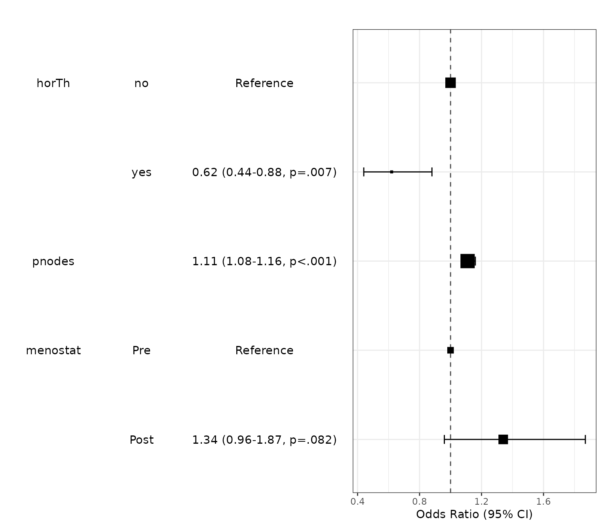
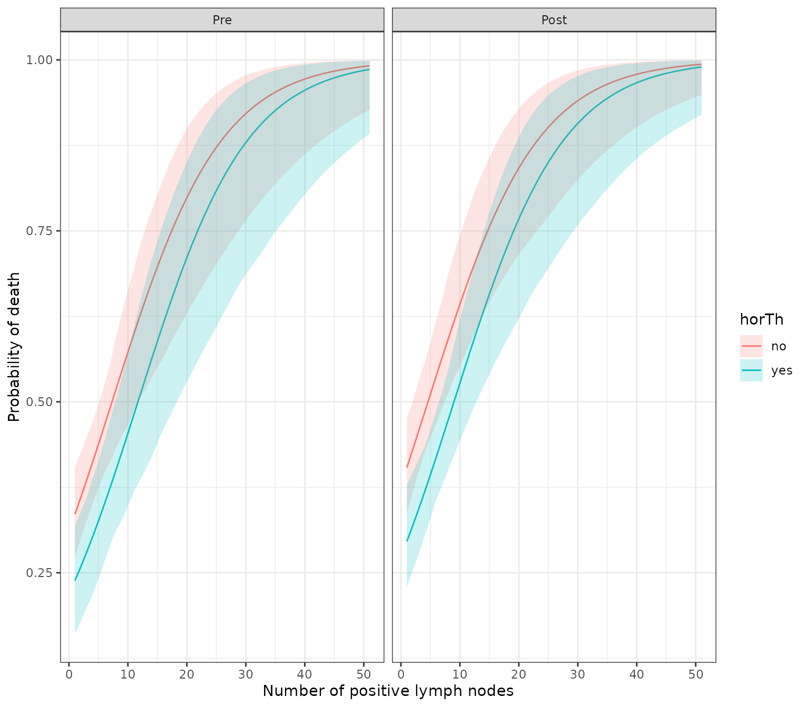

# Bootstrap Simulation for model prediction

You can make a bootstrap simulation for model prediction. When writing
bootPredict function and this vignette, I was inspired from package
finalfit by Ewen Harrison. For example, you can predict survival after
diagnosis of breast cancer.

``` r
library(autoReg)
library(dplyr)  # for use `%>%`

Attaching package: 'dplyr'
The following objects are masked from 'package:stats':

    filter, lag
The following objects are masked from 'package:base':

    intersect, setdiff, setequal, union
data(GBSG2,package="TH.data")
head(GBSG2)
  horTh age menostat tsize tgrade pnodes progrec estrec time cens
1    no  70     Post    21     II      3      48     66 1814    1
2   yes  56     Post    12     II      7      61     77 2018    1
3   yes  58     Post    35     II      9      52    271  712    1
4   yes  59     Post    17     II      4      60     29 1807    1
5    no  73     Post    35     II      1      26     65  772    1
6    no  32      Pre    57    III     24       0     13  448    1
```

Data `GBGS2` in TH.data package is a data frame containing the
observations from the German Breast Cancer Study Group 2. In this data,
the survival status of patients is coded as 0 or 1 in the variable
`cens`. Whether the patient receive the hormonal therapy or not is
recorded as ‘no’ or ‘yes’ in variable `horTh`. The number of positive
lymph nodes are recoded in pnodes. You can make a logistic regression
model with the following R code.

``` r
GBSG2$cens.factor=factor(GBSG2$cens,labels=c("Alive","Died"))
fit=glm(cens.factor~horTh+pnodes+menostat,data=GBSG2,family="binomial")
summary(fit)

Call:
glm(formula = cens.factor ~ horTh + pnodes + menostat, family = "binomial", 
    data = GBSG2)

Coefficients:
             Estimate Std. Error z value Pr(>|z|)    
(Intercept)  -0.79237    0.15183  -5.219 1.80e-07 ***
horThyes     -0.47782    0.17578  -2.718  0.00656 ** 
pnodes        0.10853    0.01818   5.970 2.38e-09 ***
menostatPost  0.29375    0.16905   1.738  0.08228 .  
---
Signif. codes:  0 '***' 0.001 '**' 0.01 '*' 0.05 '.' 0.1 ' ' 1

(Dispersion parameter for binomial family taken to be 1)

    Null deviance: 939.68  on 685  degrees of freedom
Residual deviance: 887.36  on 682  degrees of freedom
AIC: 895.36

Number of Fisher Scoring iterations: 4
```

You can make a publication-ready table with the following R command.

``` r

autoReg(fit) %>% myft()
```

| Dependent: cens.factor |  | Alive (N=387) | Died (N=299) | OR (multivariable) |
|----|----|----|----|----|
| horTh | no | 235 (60.7%) | 205 (68.6%) |  |
|  | yes | 152 (39.3%) | 94 (31.4%) | 0.62 (0.44-0.88, p=.007) |
| pnodes | Mean ± SD | 3.8 ± 4.6 | 6.5 ± 6.1 | 1.11 (1.08-1.16, p\<.001) |
| menostat | Pre | 171 (44.2%) | 119 (39.8%) |  |
|  | Post | 216 (55.8%) | 180 (60.2%) | 1.34 (0.96-1.87, p=.082) |
|  |  |  |  |  |

You can draw a plot summarizing the model.

``` r
modelPlot(fit)
Warning: 
[1m
[22m`aes_string()` was deprecated in ggplot2 3.0.0.

[36mℹ
[39m Please use tidy evaluation idioms with `aes()`.

[36mℹ
[39m See also `vignette("ggplot2-in-packages")` for more information.

[36mℹ
[39m The deprecated feature was likely used in the 
[34mautoReg
[39m package.
  Please report the issue at 
[3m
[34m<https://github.com/cardiomoon/autoReg/issues>
[39m
[23m.

[90mThis warning is displayed once per session.
[39m

[90mCall `lifecycle::last_lifecycle_warnings()` to see where this warning was
[39m

[90mgenerated.
[39m
```



For bootstrapping simulation, you can make new data with the following R
code.

``` r

newdata=expand.grid(horTh=factor(c(1,2),labels=c("no","yes")),
                    pnodes=1:51,
                    menostat=factor(c(1,2),labels=c("Pre","Post")))
```

You can make a bootstrapping simulation with bootPredict() function. You
can set the number of simulation by adjusting R argument.

``` r
df=bootPredict(fit,newdata,R=500)
head(df)
  horTh pnodes menostat  estimate     lower     upper
1    no      1      Pre 0.3354033 0.2724279 0.4046308
2   yes      1      Pre 0.2383652 0.1603463 0.3184490
3    no      2      Pre 0.3600105 0.2997684 0.4247951
4   yes      2      Pre 0.2586235 0.1789604 0.3398288
5    no      3      Pre 0.3853762 0.3262596 0.4475414
6   yes      3      Pre 0.2799707 0.1986792 0.3594128
```

With this result, you can draw a plot showing bootstrapping prediction
of breast cancer.

``` r

library(ggplot2)
ggplot(df,aes(x=pnodes,y=estimate))+
  geom_line(aes(color=horTh))+
  geom_ribbon(aes(ymin=lower,ymax=upper,fill=horTh),alpha=0.2)+
  facet_wrap(~menostat)+
  theme_bw()+
  labs(x="Number of positive lymph nodes", y="Probability of death")
```


