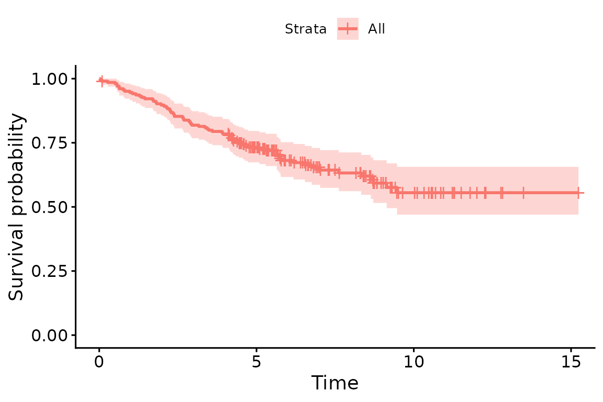
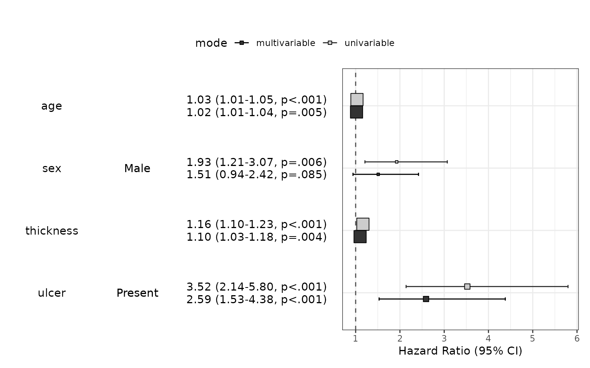
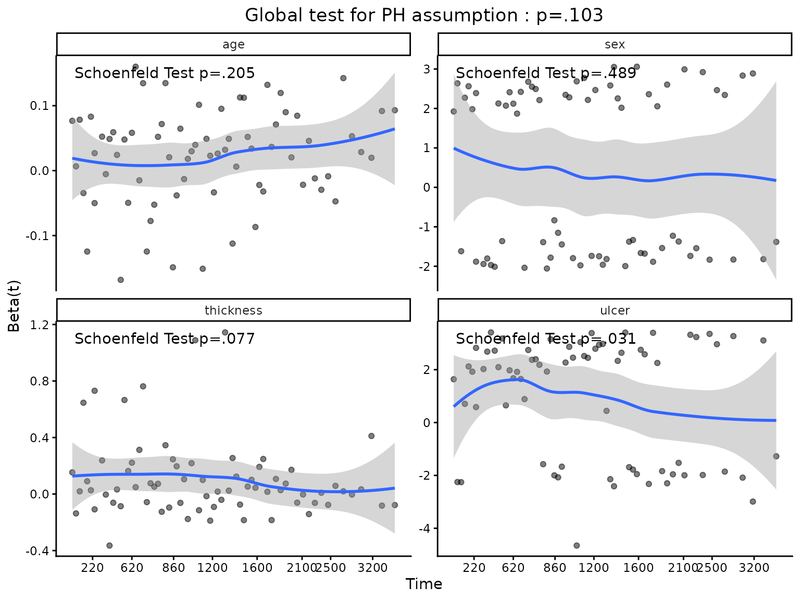
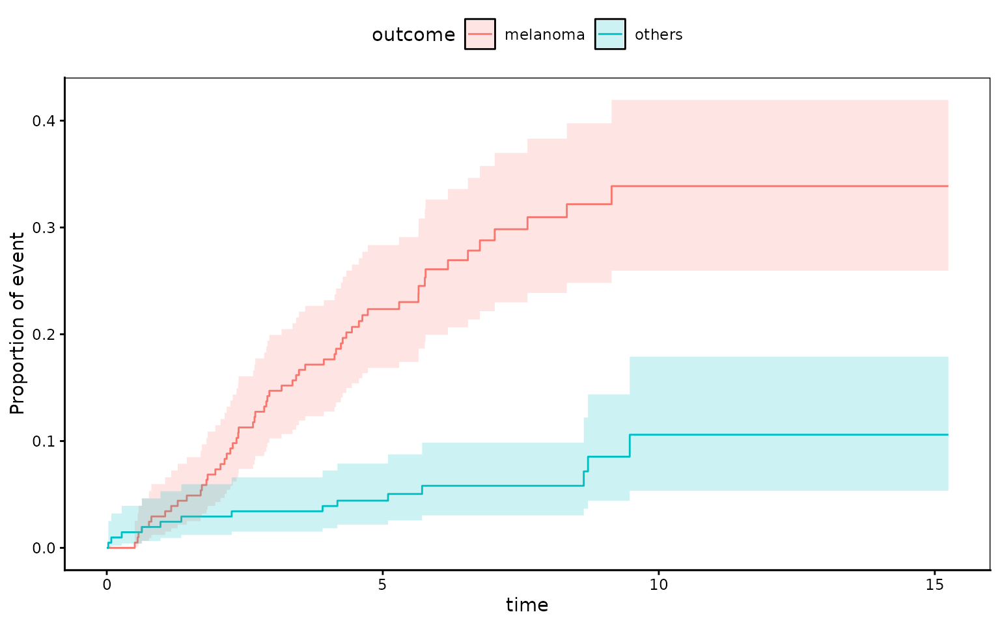
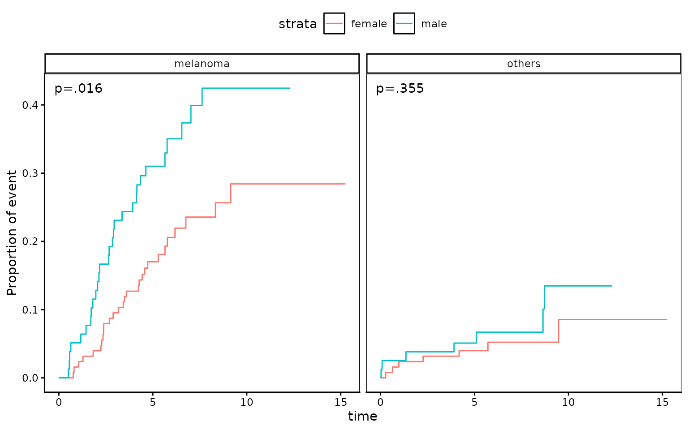

# Survival Analysis

## What is survival analysis ?

Survival analysis is the study of survival times and of the factors that
influence them. Types of studies with survival outcomes include clinical
trials, prospective and retrospective observational studies, and animal
experiments. Examples of survival times include time from birth until
death, time from entry into a clinical trial until death or disease
progression, or time from birth to development of breast cancer(that is,
age of onset). The survival endpoint can also refer a positive event.
For example, one might be interested in the time from entry into a
clinical trial until tumor response.

Package autoReg provides a number of functions to make these analyses
easy to perform.

When writing package autoReg and this vignette, I was inspired from
package finalfit by Ewen Harrison.

## Installation

You can install autoReg package on github.

``` r

#install.packages("devtools")
devtools::install_github("cardiomoon/autoReg")
```

## Load package

To load the package, use library() function.

``` r

library(autoReg)
library(survival)
library(dplyr)
```

## Data `melanoma`

The data melanoma included in the boot package is a data of 205 patients
with malignant melanoma. Each patient had their tumor removed by surgery
at the Department of Plastic Surgery, University Hospital of Odense,
Denmark during the period 1962 to 1977. The surgery consisted of
complete removal of the tumor together with about 2.5cm of the
surrounding skin. Among the measurements taken were the thickness of the
tumor and whether it was ulcerated or not. These are thought to be
important prognostic variables in that patients with a thick and/or
ulcerated tumor have an increased chance of death from melanoma.
Patients were followed until the end of 1977.

``` r
data(melanoma,package="boot")
gaze(melanoma)
———————————————————————————————————————
   name      levels         stats      
———————————————————————————————————————
time       Mean ± SD    2152.8 ± 1122.1 
status     Mean ± SD          1.8 ± 0.6 
sex        Mean ± SD          0.4 ± 0.5 
age        Mean ± SD        52.5 ± 16.7 
year       Mean ± SD       1969.9 ± 2.6 
thickness  Mean ± SD          2.9 ± 3.0 
ulcer      Mean ± SD          0.4 ± 0.5 
———————————————————————————————————————
```

The patient status at the end of study was coded in status variable.

- 1 indicates that they had died from melanoma
- 2 indicates that they were still alive
- 3 indicates that they had died from causes unrelated to their
  melanoma.

There are three options for coding this.

- Overall survival: considering all-cause mortality, comparing 2 (alive)
  with 1 (died melanoma)/3 (died other) by logical expression status!=2
  (e.g. status is not equal to 2)
- Cause-specific survival: considering disease-specific mortality
  comparing 2 (alive)/3 (died other) with 1 (died melanoma) by status==1
  (e.g. status is equal to 1 )
- Competing risks: comparing 2 (alive) with 1 (died melanoma) accounting
  for 3 (died other); So we will make a new variable `statusCRR`

The `sex` variable in melanoma is coded as 0=female and 1=male. The
`ulcer` variable is coded as 1=present and 2= absent. It is possible to
use this variables during analysis, but we change these variables to
factor with proper labels(just for aesthetic purpose).

``` r

melanoma$status1 = ifelse(melanoma$status==1,1,ifelse(melanoma$status==2,0,2))
melanoma$statusCRR=factor(melanoma$status1,labels=c("survived","melanoma","other cause"))
melanoma$sex=factor(melanoma$sex,labels=c("Female","Male"))
melanoma$ulcer=factor(melanoma$ulcer,labels=c("Absent","Present"))
```

``` r
gaze(melanoma,show.n=TRUE)
———————————————————————————————————————————————————
   name       levels      N        stats        n  
———————————————————————————————————————————————————
time       Mean ± SD      205  2152.8 ± 1122.1  205 
status     Mean ± SD      205        1.8 ± 0.6  205 
sex        Female         205      126 (61.5%)  126 
           Male                     79 (38.5%)   79 
age        Mean ± SD      205      52.5 ± 16.7  205 
year       Mean ± SD      205     1969.9 ± 2.6  205 
thickness  Mean ± SD      205        2.9 ± 3.0  205 
ulcer      Absent         205      115 (56.1%)  115 
           Present                  90 (43.9%)   90 
status1    Mean ± SD      205        0.4 ± 0.6  205 
statusCRR  survived       205      134 (65.4%)  134 
           melanoma                 57 (27.8%)   57 
           other cause               14 (6.8%)   14 
———————————————————————————————————————————————————
```

## Survival analysis for whole group

You can estimate survival in whole group with survfit() function in the
survival package.

``` r
fit=survfit(Surv(time/365.25,status!=2)~1,data=melanoma)
fit
Call: survfit(formula = Surv(time/365.25, status != 2) ~ 1, data = melanoma)

       n events median 0.95LCL 0.95UCL
[1,] 205     71     NA    9.14      NA
```

### Life table

A life table is the tabular form of a KM plot. It shows survival as a
proportion, together with confidence limits.

``` r
summary(fit,times=0:5)
Call: survfit(formula = Surv(time/365.25, status != 2) ~ 1, data = melanoma)

 time n.risk n.event survival std.err lower 95% CI upper 95% CI
    0    205       0    1.000  0.0000        1.000        1.000
    1    193      11    0.946  0.0158        0.916        0.978
    2    183      10    0.897  0.0213        0.856        0.940
    3    167      16    0.819  0.0270        0.767        0.873
    4    160       7    0.784  0.0288        0.730        0.843
    5    122      10    0.732  0.0313        0.673        0.796
```

### Kaplan-Meier Plot

You can plot survival curves using the ggsurvplot() in the survminer
package. There are numerous options available on the help page.

``` r

library(survminer)
ggsurvplot(fit)
```



### Cox-proportional hazard model

The coxph() function in the survival package fits a Cox proportional
hazards regression model. Time dependent variables, time dependent
strata, multiple events per subject, and other extensions are
incorporated using the counting process formulation of Andersen and
Gill.

``` r

fit=coxph(Surv(time,status!=2)~age+sex+thickness+ulcer,data=melanoma)
```

You can summarize the results of coxph() with autoReg() function. With a
list of univariable model, you can select potentially significant
explanatory variable(p value below 0.2 for example). The autoReg()
function automatically select from univariable model with a given p
value threshold(default value is 0.2). If you want to use all the
explanatory variables in the multivariable model, set the threshold 1.

``` r

x=autoReg(fit,uni=TRUE,threshold=1)
x %>% myft()
```

| Dependent: Surv(time, status != 2) |  | all | HR (univariable) | HR (multivariable) |
|----|----|----|----|----|
| age | Mean ± SD | 52.5 ± 16.7 | 1.03 (1.01-1.05, p\<.001) | 1.02 (1.01-1.04, p=.005) |
| sex | Female | 126 (61.5%) |  |  |
|  | Male | 79 (38.5%) | 1.93 (1.21-3.07, p=.006) | 1.51 (0.94-2.42, p=.085) |
| thickness | Mean ± SD | 2.9 ± 3.0 | 1.16 (1.10-1.23, p\<.001) | 1.10 (1.03-1.18, p=.004) |
| ulcer | Absent | 115 (56.1%) |  |  |
|  | Present | 90 (43.9%) | 3.52 (2.14-5.80, p\<.001) | 2.59 (1.53-4.38, p\<.001) |
| n=205, events=71, Likelihood ratio test=47.89 on 4 df(p\<.001) |  |  |  |  |

If you want, you can decorate your table as follows:

``` r

x$name=c("Age(years)","Sex","","Tumor thickness (mm)","Ulceration","")
names(x)[1]="Overall Survival"
x %>% myft()
```

| Dependent: Surv(time, status != 2) |  | all | HR (univariable) | HR (multivariable) |
|----|----|----|----|----|
| Age(years) | Mean ± SD | 52.5 ± 16.7 | 1.03 (1.01-1.05, p\<.001) | 1.02 (1.01-1.04, p=.005) |
| Sex | Female | 126 (61.5%) |  |  |
|  | Male | 79 (38.5%) | 1.93 (1.21-3.07, p=.006) | 1.51 (0.94-2.42, p=.085) |
| Tumor thickness (mm) | Mean ± SD | 2.9 ± 3.0 | 1.16 (1.10-1.23, p\<.001) | 1.10 (1.03-1.18, p=.004) |
| Ulceration | Absent | 115 (56.1%) |  |  |
|  | Present | 90 (43.9%) | 3.52 (2.14-5.80, p\<.001) | 2.59 (1.53-4.38, p\<.001) |
| n=205, events=71, Likelihood ratio test=47.89 on 4 df(p\<.001) |  |  |  |  |

#### Hazard ratio plot : modelPlot()

You can draw hazard ratio plot

``` r
modelPlot(fit,uni=TRUE, threshold=1,show.ref=FALSE)
Warning: 
[1m
[22m`aes_string()` was deprecated in ggplot2 3.0.0.

[36mℹ
[39m Please use tidy evaluation idioms with `aes()`.

[36mℹ
[39m See also `vignette("ggplot2-in-packages")` for more information.

[36mℹ
[39m The deprecated feature was likely used in the 
[34mautoReg
[39m package.
  Please report the issue at 
[3m
[34m<https://github.com/cardiomoon/autoReg/issues>
[39m
[23m.

[90mThis warning is displayed once per session.
[39m

[90mCall `lifecycle::last_lifecycle_warnings()` to see where this warning was
[39m

[90mgenerated.
[39m
```



If you want to add another model summary to the table, the
addFitSummary() can do this.

``` r

final=coxph(Surv(time,status!=2)~age+thickness+ulcer,data=melanoma)
x=x %>% addFitSummary(final,statsname="HR (final)") 
x %>% myft()
```

| Dependent: Surv(time, status != 2) |  | all | HR (univariable) | HR (multivariable) | HR (final) |
|----|----|----|----|----|----|
| Age(years) | Mean ± SD | 52.5 ± 16.7 | 1.03 (1.01-1.05, p\<.001) | 1.02 (1.01-1.04, p=.005) | 1.02 (1.01-1.04, p=.003) |
| Sex | Female | 126 (61.5%) |  |  |  |
|  | Male | 79 (38.5%) | 1.93 (1.21-3.07, p=.006) | 1.51 (0.94-2.42, p=.085) |  |
| Tumor thickness (mm) | Mean ± SD | 2.9 ± 3.0 | 1.16 (1.10-1.23, p\<.001) | 1.10 (1.03-1.18, p=.004) | 1.10 (1.03-1.18, p=.003) |
| Ulceration | Absent | 115 (56.1%) |  |  |  |
|  | Present | 90 (43.9%) | 3.52 (2.14-5.80, p\<.001) | 2.59 (1.53-4.38, p\<.001) | 2.72 (1.61-4.57, p\<.001) |
| n=205, events=71, Likelihood ratio test=47.89 on 4 df(p\<.001) |  |  |  |  |  |

#### Testing for proportional hazards

An assumption of Cox proportional hazard regression is that the hazard
(think risk) associated with a particular variable does not change over
time. For example, is the magnitude of the increase in risk of death
associated with tumor ulceration the same in the early post-operative
period as it is in later years?

The cox.zph() function from the survival package allows us to test this
assumption for each variable. The plot of scaled Schoenfeld residuals
should be a horizontal line. The included hypothesis test identifies
whether the gradient differs from zero for each variable. No variable
significantly differs from zero at the 5% significance level.

``` r
result=cox.zph(fit)
result
          chisq df     p
age       1.610  1 0.205
sex       0.478  1 0.489
thickness 3.124  1 0.077
ulcer     4.633  1 0.031
GLOBAL    7.706  4 0.103
```

``` r

coxzphplot(result)
```



### Disease-specific survival

You can analyze disease specific survival and make a publication-ready
table.

``` r

fit=coxph(Surv(time,status==1)~age+sex+thickness+ulcer,data=melanoma)
autoReg(fit,uni=TRUE,threshold=1) %>% myft()
```

| Dependent: Surv(time, status == 1) |  | all | HR (univariable) | HR (multivariable) |
|----|----|----|----|----|
| age | Mean ± SD | 52.5 ± 16.7 | 1.02 (1.00-1.04, p=.028) | 1.01 (1.00-1.03, p=.141) |
| sex | Female | 126 (61.5%) |  |  |
|  | Male | 79 (38.5%) | 1.94 (1.15-3.26, p=.013) | 1.54 (0.91-2.60, p=.106) |
| thickness | Mean ± SD | 2.9 ± 3.0 | 1.17 (1.10-1.25, p\<.001) | 1.12 (1.04-1.20, p=.004) |
| ulcer | Absent | 115 (56.1%) |  |  |
|  | Present | 90 (43.9%) | 4.36 (2.44-7.77, p\<.001) | 3.20 (1.75-5.88, p\<.001) |
| n=205, events=57, Likelihood ratio test=41.62 on 4 df(p\<.001) |  |  |  |  |

### Competing risk regression

Competing-risks regression is an alternative to cox proportional
regression. It can be useful if the outcome of interest may not be able
to occur simply because something else (like death) has happened first.
For instance, in our example it is obviously not possible for a patient
to die from melanoma if they have died from another disease first. By
simply looking at cause-specific mortality (deaths from melanoma) and
considering other deaths as censored, bias may result in estimates of
the influence of predictors.

The approach by Fine and Gray is one option for dealing with this. It is
implemented in the package `cmprsk`. The crrFormula() function in
autoReg package can make competing risk regression model and
addFitSummary() function can add the model summary.

``` r

fit1=crrFormula(time+status1~age+sex+thickness+ulcer,data=melanoma)
autoReg(fit,uni=TRUE,threshold=1) %>% 
  addFitSummary(fit1,"HR (competing risks multivariable)") %>% 
  myft()
```

| Dependent: Surv(time, status == 1) |  | all | HR (univariable) | HR (multivariable) | HR (competing risks multivariable) |
|----|----|----|----|----|----|
| age | Mean ± SD | 52.5 ± 16.7 | 1.02 (1.00-1.04, p=.028) | 1.01 (1.00-1.03, p=.141) | 1.01 (0.99-1.02, p=.520) |
| sex | Female | 126 (61.5%) |  |  |  |
|  | Male | 79 (38.5%) | 1.94 (1.15-3.26, p=.013) | 1.54 (0.91-2.60, p=.106) | 1.50 (0.87-2.57, p=.140) |
| thickness | Mean ± SD | 2.9 ± 3.0 | 1.17 (1.10-1.25, p\<.001) | 1.12 (1.04-1.20, p=.004) | 1.09 (1.01-1.18, p=.019) |
| ulcer | Absent | 115 (56.1%) |  |  |  |
|  | Present | 90 (43.9%) | 4.36 (2.44-7.77, p\<.001) | 3.20 (1.75-5.88, p\<.001) | 3.09 (1.71-5.60, p\<.001) |
| n=205, events=57, Likelihood ratio test=41.62 on 4 df(p\<.001) |  |  |  |  |  |

You can estimate cumulative incidence functions from competing risk
data.

``` r
library(cmprsk) # for use of cuminc()
melanoma$years=melanoma$time/365
fit=cuminc(melanoma$years,melanoma$status1)
fit
Estimates and Variances:
$est
             5        10        15
1 1 0.22353960 0.3387175 0.3387175
1 2 0.04419779 0.1059471 0.1059471

$var
               5          10          15
1 1 0.0008713044 0.001690760 0.001690760
1 2 0.0002086252 0.001040155 0.001040155
```

At 5 years, cumulative death incidence due to melanoma is 22.3% and
cumulative death incidence due to other cause is 4.4%.

You can plot this with the following R code.

``` r
ggcmprsk(years+status1~1,data=melanoma,id=c("alive","melanoma","others"),se=TRUE)
Warning: 
[1m
[22mRemoved 6 rows containing missing values or values outside the scale range
(`geom_stepribbon()`).
```



``` r
ggcmprsk(years+status1~sex,data=melanoma,id=c("alive","melanoma","others"),
         strata=c("female","male"))
Warning: 
[1m
[22mRemoved 8 rows containing missing values or values outside the scale range
(`geom_step()`).
```



## Analysis of clustered data

In clustered data, cases are not independent. For instance, one might be
interested in survival times of individuals that are in the same family
or in the same unit, such as a town or school. In this case, genetic or
environmental factors mean that survival times within a cluster are more
similar to each other than to those from other clusters, so that the
independence assumption no longer holds. Marginal approach and frailty
model can used to handle these type of data.

### 1. Frailty survival model

The retinopathy data is a trial of laser coagulation as a treatment to
delay diabetic retinopathy. We shall examine the effect of treatment on
time-to-blindness in patients with diabetic retinopathy, and also the
interaction of the effect of treatment(trt) with age of onset (juvenile
or adult onset), as defined by the type indicator. To estimate
individual effect, the `frailty(id)` shall be used.

``` r
data(retinopathy, package="survival")
fit=coxph(Surv(futime,status)~trt*type+frailty(id),data=retinopathy)
summary(fit)
Call:
coxph(formula = Surv(futime, status) ~ trt * type + frailty(id), 
    data = retinopathy)

  n= 394, number of events= 155 

              coef    se(coef) se2    Chisq  DF    p     
trt           -0.5059 0.2255   0.2207   5.03  1.00 0.0250
typeadult      0.3969 0.2591   0.2053   2.35  1.00 0.1300
frailty(id)                           122.55 88.58 0.0098
trt:typeadult -0.9850 0.3618   0.3553   7.41  1.00 0.0065

              exp(coef) exp(-coef) lower .95 upper .95
trt              0.6030     1.6584    0.3876    0.9380
typeadult        1.4872     0.6724    0.8949    2.4714
trt:typeadult    0.3734     2.6779    0.1838    0.7588

Iterations: 6 outer, 31 Newton-Raphson
     Variance of random effect= 0.92598   I-likelihood = -847 
Degrees of freedom for terms=  1.0  0.6 88.6  1.0 
Concordance= 0.86  (se = 0.014 )
Likelihood ratio test= 218.4  on 91.13 df,   p=2e-12
```

Variance of random effect $`\hat{\sigma}^2=0.926`$ and the p value of
frailty(id) is 0.098. So we can reject $`H_0 : \sigma^2=0`$, that is the
individual patient has different effect.  
The result is summarized as table with the following R code.

``` r

autoReg(fit) %>% myft()
```

[TABLE]

With above result, we can estimate the risk of blindness in each group.

- juvenile, not treated : $`HR = exp(0) = 1`$
- juvenile, treated : $`HR = 0.6030`$
- adult onset, not treated : $`HR = 1.4872`$
- adult onset, treated : $`HR = 0.6030\times1.4872\times0.3734=0.3348`$

The type of diabetes is not significant on the development of
blindness($`p=0.130`$). Laser treatment significantly reduced the risk
of blindness(HR 0.60(95% CI 0.39-0.94), $`p=0.03`$). Laser treatment is
effective in both type of diabetes, but more effective in adult-onset
diabetes.

### 2. Marginal approach

In the marginal approach, the proportional hazards assumption is
presumed to hold for all subjects, despite the structure in the data due
to clusters. With this approach, the parameter estimates are obtained
from a Cox proportional hazards model ignoring the cluster structure.

``` r
fit=coxph(Surv(futime,status)~trt*type+cluster(id),data=retinopathy)
summary(fit)
Call:
coxph(formula = Surv(futime, status) ~ trt + type + trt:type, 
    data = retinopathy, cluster = id)

  n= 394, number of events= 155 

                 coef exp(coef) se(coef) robust se      z Pr(>|z|)   
trt           -0.4250    0.6538   0.2177    0.1850 -2.297  0.02160 * 
typeadult      0.3413    1.4067   0.1992    0.1958  1.743  0.08129 . 
trt:typeadult -0.8459    0.4292   0.3509    0.3036 -2.786  0.00534 **
---
Signif. codes:  0 '***' 0.001 '**' 0.01 '*' 0.05 '.' 0.1 ' ' 1

              exp(coef) exp(-coef) lower .95 upper .95
trt              0.6538     1.5296    0.4549    0.9395
typeadult        1.4067     0.7109    0.9585    2.0646
trt:typeadult    0.4292     2.3301    0.2367    0.7782

Concordance= 0.613  (se = 0.019 )
Likelihood ratio test= 28.49  on 3 df,   p=3e-06
Wald test            = 34.88  on 3 df,   p=1e-07
Score (logrank) test = 28.44  on 3 df,   p=3e-06,   Robust = 30.29  p=1e-06

  (Note: the likelihood ratio and score tests assume independence of
     observations within a cluster, the Wald and robust score tests do not).
```

The result can be summarized as table.

``` r

autoReg(fit) %>% myft()
```

[TABLE]

The result of marginal approach is similar to frailty approach. But in
the frailty approach, subject-specific effect is estimated, whereas in
the marginal approach, population average effect is estimated.
